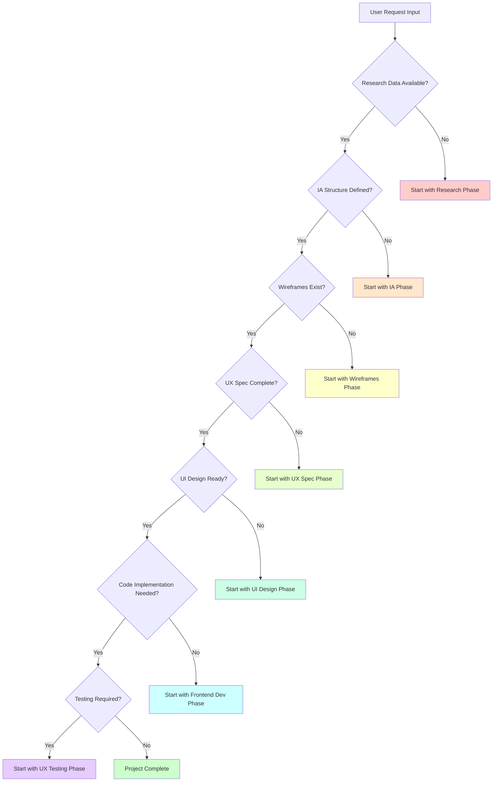

# Design Handoff Protocols & Lifecycle Management

## Artifact Format Standards

### Required Format for Each Phase Output

#### research-brief.md
**Required Sections**:
```markdown
# Research Brief: [Project Name]

## Executive Summary
- Project objectives and success metrics
- Key user insights and pain points
- Business requirements and constraints
- Timeline and resource allocation

## User Research Findings
### Primary Users
- Persona profiles with demographics, goals, frustrations
- User journey maps with current state pain points
- Behavioral patterns and preferences

### Secondary Users  
- Stakeholder profiles and requirements
- Edge case users and accessibility needs

## Competitive Analysis
### Direct Competitors
- Feature comparison matrix
- Usability strengths and weaknesses
- Design pattern analysis

### Indirect Competitors
- Alternative solutions users currently employ
- Inspiration and best practices

## Research Methodology
- Research methods used (interviews, surveys, analytics)
- Sample sizes and demographics
- Data collection timeline
- Limitations and biases

## Key Insights & Recommendations
- Prioritized list of insights
- Design implications
- Recommended next steps

## Appendix
- Raw data, interview transcripts
- Survey results and analytics screenshots
- Additional resources and references
```

**Validation Rules**:
- Must include at least 3 primary user personas
- Competitive analysis must cover minimum 5 direct competitors
- Research methodology section required for credibility
- Key insights must be ranked by impact/confidence

#### information-architecture.md
**Required Sections**:
```markdown
# Information Architecture: [Project Name]

## Site Structure
### Navigation Hierarchy
- Primary navigation (max 7 items)
- Secondary navigation structure
- Breadcrumb path definitions

### Content Organization
- Content taxonomy and categorization
- Tagging system and metadata structure
- Search and filtering capabilities

## User Flows
### Primary User Flows
- Task-based flow diagrams
- Entry points and exit points
- Success and error paths

### Secondary User Flows
- Administrative flows
- Edge case scenarios

## Content Strategy
### Content Types
- Page templates and content blocks
- Dynamic vs static content
- Content lifecycle and maintenance

### Content Hierarchy
- Information prioritization
- Content relationships and linking
- Content personalization rules

## Technical Considerations
### URL Structure
- URL naming conventions
- SEO-friendly paths
- Redirect strategy

### Search & Discovery
- Search functionality requirements
- Faceted search and filtering
- Autocomplete and suggestions

## Validation & Testing
- Card sorting results
- Tree testing outcomes
- First-click testing analysis
```

**Validation Rules**:
- Primary navigation limited to 7 items maximum
- All user flows must have clearly defined success paths
- URL structure must follow SEO best practices
- Must include validation testing results

#### wireframes/ Directory Structure
```
wireframes/
├── mobile/
│   ├── homepage.png
│   ├── product-list.png
│   ├── product-detail.png
│   └── checkout-flow/
│       ├── cart.png
│       ├── shipping.png
│       └── payment.png
├── tablet/
│   └── [same structure as mobile]
├── desktop/
│   └── [same structure as mobile]
├── flows/
│   ├── user-registration.png
│   ├── checkout-process.png
│   └── error-recovery.png
└── components/
    ├── navigation.png
    ├── forms.png
    └── cards.png
```

**Validation Rules**:
- All three breakpoints (mobile, tablet, desktop) required
- Key user flows must be wireframed
- Component library wireframes included
- Consistent naming conventions across files

#### ux-spec.md
**Required Sections**:
```markdown
# UX Specification: [Project Name]

## Interaction Design
### Component Behaviors
- Interactive element specifications
- State changes and transitions
- Micro-interaction definitions

### User Flow Details
- Step-by-step interaction patterns
- Decision points and branching logic
- Error handling and recovery paths

## Accessibility Requirements
### WCAG 2.1 AA Compliance
- Keyboard navigation requirements
- Screen reader compatibility
- Color contrast specifications
- Focus management rules

### Assistive Technology Support
- ARIA labels and roles
- Alternative input methods
- Cognitive accessibility considerations

## Content Strategy
### Microcopy and Messaging
- Error messages and validation text
- Success confirmations and feedback
- Help text and tooltips

### Content Guidelines
- Tone of voice specifications
- Content length constraints
- Localization considerations

## Technical Requirements
### Performance Specifications
- Loading time requirements
- Animation performance guidelines
- Asset optimization requirements

### Browser and Device Support
- Supported browsers and versions
- Device compatibility matrix
- Progressive enhancement strategy

## Validation Criteria
### User Testing Requirements
- Usability testing methodology
- Acceptance criteria per feature
- Success metrics and KPIs
```

**Validation Rules**:
- All interactive elements must have defined behaviors
- Accessibility requirements must reference WCAG 2.1 AA
- Performance specifications must be quantifiable
- Validation criteria must be testable

#### ui-design/ Directory Structure
```
ui-design/
├── design-system/
│   ├── tokens.css
│   ├── components/
│   │   ├── buttons.fig
│   │   ├── forms.fig
│   │   └── navigation.fig
│   └── patterns/
│       ├── hero-sections.fig
│       └── content-blocks.fig
├── screens/
│   ├── mobile/
│   ├── tablet/
│   └── desktop/
├── prototypes/
│   ├── interactive-prototype.fig
│   └── micro-interactions.fig
├── assets/
│   ├── icons/
│   ├── images/
│   └── illustrations/
└── specs/
    ├── redlines.pdf
    └── developer-handoff.pdf
```

**Validation Rules**:
- Design system tokens must be complete and documented
- All wireframed screens must have corresponding UI designs
- Interactive prototypes required for complex flows
- Developer handoff specs must include measurements and assets

#### src/ Code Implementation
```
src/
├── components/
│   ├── ui/
│   │   ├── Button/
│   │   ├── Input/
│   │   └── Modal/
│   ├── layout/
│   │   ├── Header/
│   │   ├── Footer/
│   │   └── Navigation/
│   └── features/
│       ├── Auth/
│       ├── Checkout/
│       └── Profile/
├── styles/
│   ├── tokens.css
│   ├── globals.css
│   └── components.css
├── utils/
├── hooks/
└── pages/
    ├── index.tsx
    ├── products/
    └── checkout/
```

**Validation Rules**:
- Component structure must match design system
- All design tokens implemented in CSS
- Responsive breakpoints match design specifications
- Accessibility attributes properly implemented

#### ux-test-report.md
**Required Sections**:
```markdown
# UX Test Report: [Project Name]

## Test Summary
### Methodology
- Testing approach and tools used
- User demographics and sample size
- Testing environment and conditions

### Key Findings
- Overall usability score
- Task completion rates
- Critical issues identified
- User satisfaction metrics

## Detailed Results
### Task Analysis
- Per-task completion rates
- Average completion times
- Error rates and patterns
- User feedback and quotes

### Accessibility Testing
- WCAG 2.1 AA compliance results
- Assistive technology testing outcomes
- Keyboard navigation assessment

### Performance Testing
- Loading time measurements
- Core Web Vitals results
- Device and browser compatibility

## Recommendations
### Critical Issues
- Issues blocking user task completion
- Accessibility barriers
- Performance problems

### Enhancement Opportunities
- Usability improvements
- Feature suggestions
- Future optimization areas

## Validation
- Acceptance criteria met/not met
- Success metrics achieved
- Ready for production assessment
```

**Validation Rules**:
- Must include quantitative usability scores
- Accessibility testing results required
- Performance metrics must meet established benchmarks
- Clear pass/fail verdict for production readiness

## Handoff Block Format

### Structured Markdown Block Template

```markdown
## 🔄 HANDOFF: [Source Phase] → [Target Phase]

**From**: [Source Agent Name]
**To**: [Target Agent Name]  
**Date**: [ISO Date]
**Phase Transition**: [Current Phase] → [Next Phase]

### 📋 Artifacts Delivered
- [ ] [Artifact 1 Path] - [Description]
- [ ] [Artifact 2 Path] - [Description]
- [ ] [Artifact 3 Path] - [Description]

### ✅ Review Verdict
**Overall Score**: [X/100]
**Status**: APPROVED | APPROVED_WITH_CONDITIONS | REVISION_REQUIRED | REJECTED

**Critical Issues**: [Number]
**Standard Issues**: [Number]

### 🔍 Review Summary
[Brief summary of review findings and overall quality assessment]

### ⚠️ Conditions & Requirements
[If APPROVED_WITH_CONDITIONS, list required fixes before proceeding]

### 📝 Context Summary
**Project Scope**: [Brief project description]
**Key Requirements**: [Critical requirements to maintain]
**Success Metrics**: [How success will be measured]
**Constraints**: [Budget, timeline, technical limitations]

### 🔗 Reference Links
- Design System: [Link]
- Research Brief: [Link]
- Previous Phase Artifacts: [Link]

---
**Next Steps**: [Specific actions for receiving agent]
**Estimated Timeline**: [Expected completion time]
```

### Example Handoff Block

```markdown
## 🔄 HANDOFF: UX Design → UI Design

**From**: UX Design Agent
**To**: UI Design Agent  
**Date**: 2025-01-15T10:30:00Z
**Phase Transition**: UX Specification → UI Design

### 📋 Artifacts Delivered
- [x] ux-spec.md - Complete UX specification with interaction details
- [x] wireframes/desktop/ - Desktop wireframes for all key pages
- [x] wireframes/mobile/ - Mobile wireframes with responsive considerations
- [x] wireframes/flows/ - User flow diagrams with decision points

### ✅ Review Verdict
**Overall Score**: 89/100
**Status**: APPROVED_WITH_CONDITIONS

**Critical Issues**: 0
**Standard Issues**: 3

### 🔍 Review Summary
UX specification is comprehensive with well-defined interactions and accessibility requirements. Wireframes clearly communicate layout structure and responsive behavior. Minor improvements needed in form validation specifications and error state documentation.

### ⚠️ Conditions & Requirements
1. Add detailed form validation error states to wireframes
2. Specify loading states for async operations in UX spec
3. Include keyboard navigation flow documentation

### 📝 Context Summary
**Project Scope**: E-commerce platform redesign focusing on checkout optimization
**Key Requirements**: Improve conversion rate by 15%, maintain WCAG 2.1 AA compliance
**Success Metrics**: Task completion rate >90%, checkout abandonment <25%
**Constraints**: 6-week timeline, existing design system must be leveraged

### 🔗 Reference Links
- Design System: /design-system/tokens.css
- Research Brief: /research-brief.md
- Previous Phase Artifacts: /information-architecture.md

---
**Next Steps**: Create visual designs based on approved wireframes and UX spec, address conditions during design phase
**Estimated Timeline**: 2 weeks for complete UI design phase
```

## Lifecycle State Management

### lifecycle-state.md Format

```markdown
# Project Lifecycle State: [Project Name]

**Last Updated**: [ISO Timestamp]
**Project Manager**: [Agent/Human Name]
**Overall Status**: [IN_PROGRESS | COMPLETED | BLOCKED | FAILED]

## Phase Status Matrix

| Phase | Status | Artifacts | Score | Retry Count | Last Updated | Notes |
|-------|--------|-----------|-------|-------------|--------------|--------|
| Research | ✅ COMPLETED | research-brief.md | 94/100 | 0 | 2025-01-10T09:00:00Z | Initial research phase |
| Information Architecture | ✅ COMPLETED | information-architecture.md | 87/100 | 1 | 2025-01-12T14:30:00Z | Revised after feedback |
| Wireframes | ✅ COMPLETED | wireframes/ | 91/100 | 0 | 2025-01-14T16:45:00Z | All breakpoints delivered |
| UX Design | 🔄 IN_PROGRESS | ux-spec.md | - | 0 | 2025-01-15T10:30:00Z | Currently being worked |
| UI Design | ⏳ PENDING | - | - | 0 | - | Waiting for UX completion |
| Frontend Dev | ⏳ PENDING | - | - | 0 | - | Scheduled after UI |
| UX Testing | ⏳ PENDING | - | - | 0 | - | Final validation phase |

## Current Phase Details

**Active Phase**: UX Design
**Assigned Agent**: UX Design Agent v2.1
**Started**: 2025-01-15T08:00:00Z
**Expected Completion**: 2025-01-17T17:00:00Z
**Progress**: 60%

### Current Phase Artifacts
- [ ] ux-spec.md (60% complete)
- [ ] interaction-prototypes/ (30% complete)
- [ ] accessibility-audit.md (10% complete)

### Blockers & Risks
- None currently identified

## Quality Gates Passed

### Research Phase (✅ PASSED)
- **Review Score**: 94/100
- **Review Date**: 2025-01-10T15:00:00Z
- **Reviewer**: Design Review Agent v1.8
- **Critical Issues**: 0
- **Verdict**: APPROVED

### Information Architecture Phase (✅ PASSED)
- **Review Score**: 87/100
- **Review Date**: 2025-01-12T16:00:00Z
- **Reviewer**: Design Review Agent v1.8
- **Critical Issues**: 1 (resolved in retry)
- **Verdict**: APPROVED_WITH_CONDITIONS (conditions met)

### Wireframes Phase (✅ PASSED)
- **Review Score**: 91/100
- **Review Date**: 2025-01-14T18:00:00Z
- **Reviewer**: Design Review Agent v1.8
- **Critical Issues**: 0
- **Verdict**: APPROVED

## Project Metrics

**Overall Timeline**: 6 weeks
**Elapsed Time**: 1.5 weeks
**Remaining Time**: 4.5 weeks
**Budget Used**: 25%
**Risk Level**: LOW

## Change Log

| Date | Phase | Change | Impact | Reason |
|------|-------|---------|--------|--------|
| 2025-01-12 | IA | Navigation structure revised | Low | User testing feedback |
| 2025-01-13 | Wireframes | Added tablet breakpoints | Medium | Stakeholder request |
```

### Status Enums

**Phase Status Options**:
- `PENDING`: Phase not yet started, waiting for dependencies
- `IN_PROGRESS`: Phase actively being worked on
- `COMPLETED`: Phase finished and artifacts delivered
- `FAILED`: Phase attempted but failed quality gates
- `BLOCKED`: Phase cannot proceed due to external dependencies
- `SKIPPED`: Phase intentionally bypassed for this project

**Overall Project Status**:
- `IN_PROGRESS`: Some phases completed, others in progress/pending
- `COMPLETED`: All phases completed successfully
- `BLOCKED`: Project cannot proceed due to critical blocker
- `FAILED`: Project failed and requires restart or cancellation

### Per-Phase Tracking

**Required Tracking Data**:
```yaml
phase_tracking:
  phase_name: "ux_design"
  status: "in_progress"
  artifacts:
    - path: "ux-spec.md"
      completion_percentage: 75
      last_modified: "2025-01-15T14:30:00Z"
  review_score: null  # Set after phase completion
  retry_count: 0
  timestamps:
    started: "2025-01-15T08:00:00Z"
    completed: null
    last_updated: "2025-01-15T14:30:00Z"
  assigned_agent: "ux-design-agent-v2.1"
  blockers: []
  notes: "Progress steady, no issues identified"
```

## Quality Gate Procedures

### When to Invoke Reviewer

**Automatic Review Triggers**:
- Phase artifact completion claimed by working agent
- Retry attempt after failed review (max 2 retries)
- Manual review request from project manager
- Scheduled review checkpoint reached

**Review Invocation Process**:
1. Working agent commits final artifacts to phase directory
2. Working agent updates lifecycle state to request review
3. Master agent invokes reviewer with handoff context
4. Reviewer analyzes artifacts against phase requirements
5. Reviewer returns verdict with score and feedback

### Processing Review Verdicts

**Verdict Processing Logic**:
```yaml
verdict_processing:
  APPROVED:
    action: "proceed_to_next_phase"
    update_lifecycle: "mark_current_phase_completed"
    handoff_artifacts: "prepare_handoff_block"
    
  APPROVED_WITH_CONDITIONS:
    action: "conditional_proceed"
    requirements: "document_conditions_in_handoff"
    monitoring: "track_condition_resolution"
    
  REVISION_REQUIRED:
    action: "return_to_working_agent"
    feedback: "provide_detailed_revision_requirements" 
    retry_increment: "increment_retry_count"
    
  REJECTED:
    action: "major_rework_required"
    escalation: "notify_project_manager"
    decision: "restart_phase_or_abort_project"
```

### Retry Logic (Max 2 Retries)

**Retry Management**:
- **First Retry**: Return to same agent with specific feedback
- **Second Retry**: Return to same agent with enhanced guidance
- **Third Attempt Failure**: Escalate to project manager for intervention

**Retry Tracking**:
```yaml
retry_tracking:
  phase: "ui_design"
  current_retry: 1
  max_retries: 2
  retry_history:
    - attempt: 1
      date: "2025-01-16T10:00:00Z"
      score: 68
      verdict: "REVISION_REQUIRED"
      feedback: "Color contrast issues, inconsistent spacing"
    - attempt: 2
      date: "2025-01-17T09:00:00Z"
      score: 89
      verdict: "APPROVED"
      feedback: "All issues addressed successfully"
```

### Escalation Protocol

**Escalation Triggers**:
- Phase fails after maximum retries
- Critical blocker cannot be resolved by working agent
- Timeline or budget constraints threaten project success
- Stakeholder requirements change significantly

**Escalation Process**:
1. Document escalation reason and context
2. Notify project manager (human or master agent)
3. Provide recommendations for resolution
4. Await decision on project continuation or modification

## Inter-Agent Communication

### Master Agent Context Passing

**Context Package Format**:
```yaml
agent_context:
  project_metadata:
    name: "E-commerce Redesign"
    timeline: "6 weeks"
    budget: "$50,000"
    success_metrics: ["conversion_rate_15pct_increase", "wcag_2.1_aa_compliance"]
  
  current_phase: "ui_design"
  previous_phases:
    research:
      completed: true
      score: 94
      key_insights: ["mobile_first_users", "checkout_friction", "accessibility_gaps"]
    information_architecture:
      completed: true
      score: 87
      key_decisions: ["simplified_navigation", "single_page_checkout"]
  
  project_requirements:
    target_audience: "primary_shoppers_25_45_mobile"
    business_constraints: ["existing_inventory_system", "payment_processor"]
    technical_requirements: ["react_18", "typescript", "responsive_design"]
  
  design_system:
    tokens_location: "design-system/tokens.css"
    component_library: "existing_component_library_v2"
    brand_guidelines: "brand-guidelines.pdf"
  
  stakeholder_feedback:
    - source: "product_manager"
      priority: "high"
      requirement: "checkout_must_work_without_registration"
    - source: "marketing_team"  
      priority: "medium"
      requirement: "hero_section_seasonal_campaigns"
```

### Sub-Agent Reporting Back

**Agent Completion Report Format**:
```yaml
phase_completion_report:
  agent_id: "ui-design-agent-v3.2"
  phase: "ui_design"
  status: "completed"
  completion_date: "2025-01-18T16:00:00Z"
  
  deliverables:
    - artifact: "ui-design/design-system/"
      status: "completed"
      quality_score: 92
      notes: "Extended existing design system with new components"
    - artifact: "ui-design/screens/"
      status: "completed" 
      quality_score: 89
      notes: "All wireframed screens have corresponding UI designs"
    - artifact: "ui-design/prototypes/"
      status: "completed"
      quality_score: 91
      notes: "Interactive prototypes for key user flows"
  
  challenges_encountered:
    - challenge: "brand_color_accessibility"
      solution: "adjusted_primary_color_hue_for_contrast"
      impact: "minimal"
    - challenge: "mobile_navigation_complexity"
      solution: "implemented_progressive_disclosure"
      impact: "improved_usability"
  
  recommendations_next_phase:
    - "prioritize_responsive_breakpoints_during_development"
    - "validate_color_contrast_in_actual_browser_implementation"
    - "test_interactive_prototypes_with_real_users"
  
  quality_confidence: "high"
  ready_for_review: true
```

### Deviation Protocol Format

**Deviation Report Format**:
```yaml
deviation_report:
  agent_id: "frontend-dev-agent-v1.9"
  phase: "frontend_development"
  deviation_type: "scope_change" | "technical_constraint" | "timeline_adjustment"
  
  original_requirement:
    description: "implement_custom_image_carousel"
    source: "ui_design_specifications"
  
  deviation_details:
    description: "used_existing_carousel_component_from_library"
    reason: "timeline_constraint_and_accessibility_compliance"
    impact: "positive_development_speed_maintained_accessibility"
  
  stakeholder_approval:
    required: true
    status: "pending" | "approved" | "rejected"
    approver: "project_manager"
  
  recommendations:
    - "document_component_customizations_needed"
    - "plan_carousel_enhancement_for_future_iteration"
  
  timeline_impact: "none"
  quality_impact: "positive"
  budget_impact: "cost_savings"
```

## Project Directory Structure

### Standard Directory Layout

```
project-name/
├── 📋 lifecycle-state.md
├── 📚 research-brief.md
├── 🏗️ information-architecture.md
├── 📐 wireframes/
│   ├── mobile/
│   ├── tablet/
│   ├── desktop/
│   ├── flows/
│   └── components/
├── 🎯 ux-spec.md
├── 🎨 ui-design/
│   ├── design-system/
│   ├── screens/
│   ├── prototypes/
│   ├── assets/
│   └── specs/
├── 💻 src/
│   ├── components/
│   ├── styles/
│   ├── utils/
│   ├── hooks/
│   └── pages/
├── 🧪 ux-test-report.md
├── 📦 assets/
│   ├── images/
│   ├── icons/
│   └── fonts/
├── 📖 documentation/
│   ├── handoff-history.md
│   ├── decision-log.md
│   └── stakeholder-feedback.md
└── 🔧 config/
    ├── design-tokens/
    ├── build-config/
    └── deployment/
```

### Directory Description

**Root Files**:
- `lifecycle-state.md`: Current project status and phase tracking
- `research-brief.md`: User research findings and insights
- `information-architecture.md`: Site structure and navigation
- `ux-spec.md`: Detailed UX specifications and requirements
- `ux-test-report.md`: Final testing results and validation

**Phase Directories**:
- `wireframes/`: Low-fidelity layout structures
- `ui-design/`: Visual designs, prototypes, and design system
- `src/`: Code implementation and components

**Supporting Directories**:
- `assets/`: Shared images, icons, and fonts
- `documentation/`: Process documentation and decisions
- `config/`: Technical configuration and build settings

## Decision Tree for Phase Selection

### Flowchart for Determining Starting Phase



### Phase Selection Logic

**Decision Criteria**:
1. **Artifact Availability**: What deliverables already exist?
2. **Quality Assessment**: Are existing artifacts production-ready?
3. **Scope Completeness**: Do existing artifacts cover full project scope?
4. **Stakeholder Requirements**: What level of fidelity is needed?

**Starting Phase Determination**:
```yaml
phase_selection_rules:
  research_phase:
    trigger: "no_user_research_data_available"
    required_input: "project_brief_and_business_requirements"
    
  ia_phase:
    trigger: "research_complete_but_no_site_structure"
    required_input: "research_brief_and_content_inventory"
    
  wireframes_phase:
    trigger: "ia_complete_but_no_layout_structure"  
    required_input: "information_architecture_and_user_flows"
    
  ux_spec_phase:
    trigger: "wireframes_complete_but_no_interaction_details"
    required_input: "wireframes_and_user_flow_requirements"
    
  ui_design_phase:
    trigger: "ux_spec_complete_but_no_visual_design"
    required_input: "ux_specification_and_brand_guidelines"
    
  frontend_dev_phase:
    trigger: "ui_design_complete_but_no_implementation"
    required_input: "ui_designs_and_technical_requirements"
    
  ux_testing_phase:
    trigger: "implementation_complete_but_not_validated"
    required_input: "working_prototype_or_production_site"
```

### Skip Phase Logic

**When Phases Can Be Skipped**:
- **Research**: If comprehensive recent research exists and remains valid
- **IA**: If site structure is simple/predetermined (single page, marketing site)
- **Wireframes**: If jumping directly to high-fidelity design for simple layouts
- **UX Spec**: If interactions are standard and don't require detailed specification
- **UI Design**: If using existing design system without customization
- **Frontend Dev**: If design-only project or using no-code tools
- **UX Testing**: If project is internal tool or has very limited scope

**Skip Validation Requirements**:
```yaml
skip_validation:
  research:
    conditions: ["recent_research_exists", "user_base_unchanged", "similar_product_research_available"]
    approval_required: true
    documentation: "justify_research_skip_decision"
    
  wireframes:
    conditions: ["simple_layout", "existing_component_library", "stakeholder_prefers_high_fidelity"]
    approval_required: false
    documentation: "note_wireframe_skip_rationale"
    
  ux_testing:
    conditions: ["internal_tool", "prototype_only", "budget_constraints"]
    approval_required: true
    documentation: "acknowledge_testing_risk"
```