# Module Dependency Map

## Import Graph (Internal Dependencies)

```mermaid
graph TD
    CLI[cli.py] --> CMD_INIT[commands/init_cmd]
    CLI --> CMD_INSTALL[commands/install]
    CLI --> CMD_UNINSTALL[commands/uninstall]
    CLI --> CMD_DOCTOR[commands/doctor]
    CLI --> CMD_VALIDATE[commands/validate]
    CLI --> CMD_LIST[commands/list_cmd]
    CLI --> CMD_SEARCH[commands/search]
    CLI --> CMD_INFO[commands/info]
    CLI --> CMD_PIPELINE[commands/pipeline]
    CLI --> CMD_UPDATE[commands/update]
    CLI --> CMD_MIGRATE[commands/migrate]
    CLI --> CMD_ADMIN[commands/admin]
    CLI --> CMD_CONFIG[commands/config]
    CLI --> CMD_GENERATE[commands/generate]
    CLI --> CMD_CATALOG[commands/catalog]
    CLI --> CMD_CARDS[commands/cards]
    CLI --> UTILS_OUTPUT[utils/output]
    CLI --> INIT[__init__]

    CMD_DOCTOR --> REGISTRY[core/registry]
    CMD_DOCTOR --> PLATFORM[core/platform]
    CMD_DOCTOR --> UTILS_OUTPUT
    CMD_VALIDATE --> SCHEMA_VAL[core/schema_validator]
    CMD_VALIDATE --> REGISTRY
    CMD_INSTALL --> INSTALLER[core/installer]
    CMD_PIPELINE --> PIPE_ENGINE[core/pipeline_engine]
    CMD_PIPELINE --> PIPE_STATE[core/pipeline_state]
    CMD_CATALOG --> CATALOG[core/catalog]
    CMD_MIGRATE --> MIGRATION[core/migration]
    CMD_CARDS --> REGISTRY
    CMD_GENERATE --> LLMS_TXT[core/llms_txt]

    REGISTRY --> UTILS_PATHS[utils/paths]
    PIPE_ENGINE --> PIPE_STATE
    PIPE_ENGINE --> ART_VAL[core/artifact_validator]
    POLICY[core/policy_engine] -.-> SCHEMA_VAL
    SESSION[core/session_manager] -.-> PIPE_STATE
    AGENT_MCP[core/agent_mcp] --> CATALOG

    style CLI fill:#f9f,stroke:#333
    style REGISTRY fill:#bbf,stroke:#333
    style PIPE_ENGINE fill:#bfb,stroke:#333
    style POLICY fill:#fbf,stroke:#333
    style SESSION fill:#fbb,stroke:#333
```

## Module Inventory

### src/omniskill/ (3 files)
| File | Lines | Purpose |
|------|-------|---------|
| `__init__.py` | 3 | `__version__ = "3.0.0"`, `__app_name__ = "omniskill"` |
| `__main__.py` | ~5 | Entry point: imports and calls `cli.app()` |
| `cli.py` | 86 | Typer app, global flags, 16 command registrations |

### src/omniskill/commands/ (16 files)
| File | Purpose | Third-party Deps |
|------|---------|-----------------|
| `admin.py` | Stats dashboard | typer |
| `cards.py` | Agent card viewer (table, JSON, YAML) | typer, yaml |
| `catalog.py` | MCP server catalog sub-app | typer |
| `config.py` | Get/set config values | typer |
| `doctor.py` | Health diagnostics with scoring | typer |
| `generate.py` | Generate artifacts sub-app | typer |
| `info.py` | Component detail viewer | typer |
| `init_cmd.py` | Platform detection & init | typer |
| `install.py` | Install skills/bundles to platforms | typer |
| `list_cmd.py` | List components by type | typer |
| `migrate.py` | Format migration tool | typer, yaml |
| `pipeline.py` | Pipeline sub-app (5 commands) | typer |
| `search.py` | Keyword/tag search | typer |
| `uninstall.py` | Remove installed components | typer |
| `update.py` | Update checker | typer, yaml |
| `validate.py` | Manifest/skill validation | typer, yaml |

### src/omniskill/core/ (15 files)
| File | Lines | Key Classes | Purpose |
|------|-------|-------------|---------|
| `registry.py` | 377 | `Registry`, `Skill`, `Agent`, `Bundle`, `Pipeline`, `Synapse`, `AgentCard` | Central component registry |
| `pipeline_engine.py` | 411 | `PipelineExecutor`, `PipelineDefinition`, `StepResult`, `PipelineStatus`, `StepStatus` | Pipeline execution engine |
| `session_manager.py` | 340 | `Session`, `SessionStatus`, `InvalidTransitionError` | v3 session lifecycle |
| `policy_engine.py` | 313 | `PolicyEngine`, `PolicyDecision`, `PermissionRule` | v3 policy/permission engine |
| `schema_validator.py` | 330 | `SchemaValidator`, `SchemaLintResult`, `CompatibilityChecker` | Schema linting & compat |
| `migration.py` | ~300 | `ReleaseGateValidator` | v2→v3 migration |
| `agent_mcp.py` | ~200 | `MCPConnectorManager` | MCP trust routing |
| `artifact_validator.py` | ~180 | `ArtifactValidator` | Pipeline artifact validation |
| `catalog.py` | ~170 | Dataclasses for MCP catalog | MCP server catalog |
| `installer.py` | ~150 | Installation logic | Platform installer |
| `pipeline_state.py` | ~120 | `PipelineState` | State persistence |
| `config.py` | ~100 | Configuration management | Config loading |
| `platform.py` | ~50 | `PlatformInfo` dataclass | Platform detection |
| `llms_txt.py` | ~100 | LLMs.txt generator | Discoverability |
| `telemetry.py` | ~80 | Telemetry envelope | Observability |

### src/omniskill/utils/ (2 files)
| File | Purpose | Deps |
|------|---------|------|
| `output.py` | Rich console, tables, progress bars | rich |
| `paths.py` | OMNISKILL_ROOT resolution | platformdirs |

### sdk/ (1 file)
| File | Lines | Key Class | Purpose |
|------|-------|-----------|---------|
| `omniskill.py` | 615 | `OmniSkill` | Programmatic SDK with 15 public methods |
