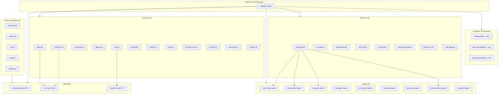
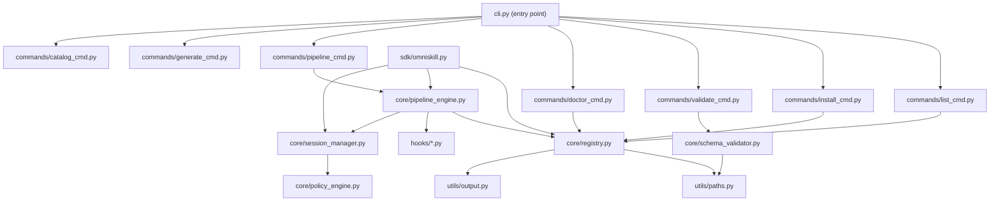
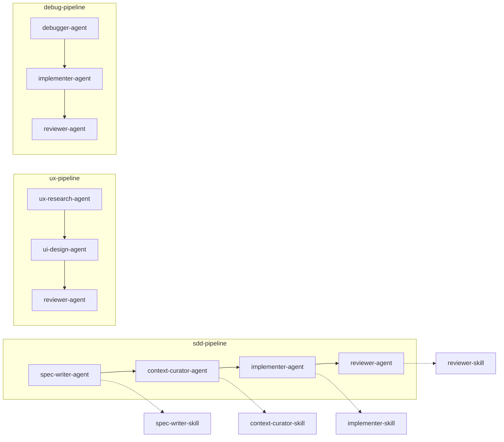
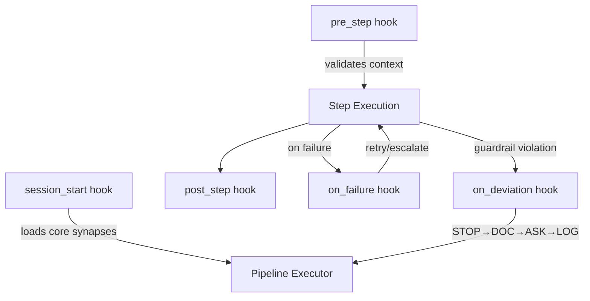

# Knowledge Graph

Complete entity-relationship map of all OMNISKILL v2.0.0 components.

## Master ER Diagram

## Module Dependency Graph

## Skill Entity Table (83 Skills)

| # | Name | Version | Tags | Priority | Bundle(s) |
|---|------|---------|------|----------|-----------|
| 1 | add-adapter | 1.0.0 | self-customization, meta | — | *orphan* |
| 2 | add-agent | 1.0.0 | self-customization, meta | — | *orphan* |
| 3 | add-bundle | 1.0.0 | self-customization, meta | — | *orphan* |
| 4 | add-skill | 1.0.0 | self-customization, meta | — | *orphan* |
| 5 | async-side-effects | 1.0.0 | async, side-effects | — | prompts-chat-kit |
| 6 | backend-development | 2.0.0 | backend, api, architecture | — | web-dev-kit, data-layer-kit |
| 7 | brainstorming | — | — | — | *orphan* |
| 8 | capacitor-best-practices | 1.0.0 | mobile, capacitor | — | mobile-kit |
| 9 | claude-plugin-archetype | 1.0.0 | claude, plugin, mcp | — | prompts-chat-kit |
| 10 | complexity-router | 1.0.0 | routing, core | P0 | *orphan* |
| 11 | content-deduplication | 1.0.0 | deduplication, similarity | — | prompts-chat-kit, data-layer-kit |
| 12 | content-moderation-pipeline | 1.0.0 | moderation, trust-safety | — | prompts-chat-kit |
| 13 | content-quality-gate | 1.0.0 | quality, validation | — | prompts-chat-kit |
| 14 | context-curator | 1.0.0 | context-management, pipeline | P1 | sdd-kit |
| 15 | design-handoff | 2.0.0 | design, handoff, lifecycle | — | sdd-kit |
| 16 | design-review | 1.0.0 | — | — | sdd-kit |
| 17 | dispatching-parallel-agents | — | — | — | *orphan* |
| 18 | django-expert | 1.0.0 | — | — | django-kit |
| 19 | django-framework | 1.0.0 | — | — | django-kit |
| 20 | django-orm-patterns | 1.0.0 | — | — | django-kit |
| 21 | django-rest-framework | 1.0.0 | — | — | django-kit |
| 22 | docker-production-build | 1.0.0 | docker, containerization | — | devops-kit |
| 23 | e2e-testing-patterns | 1.0.0 | — | — | testing-kit |
| 24 | error-handling-architecture | 1.0.0 | error-handling, reliability | — | web-dev-kit, prompts-chat-kit, security-kit |
| 25 | event-webhooks | 1.0.0 | webhooks, events, security | — | prompts-chat-kit, security-kit |
| 26 | executing-plans | — | — | — | *orphan* |
| 27 | fastmcp | 1.0.0 | — | — | *orphan* |
| 28 | find-skills | 1.0.0 | — | — | meta-kit |
| 29 | finishing-a-development-branch | — | — | — | *orphan* |
| 30 | fluent-builder | 1.0.0 | builder-pattern, fluent-api | — | prompts-chat-kit |
| 31 | frontend-design | 1.0.0 | — | — | web-dev-kit |
| 32 | godot-best-practices | 1.0.0 | — | — | godot-kit |
| 33 | godot-debugging | 1.0.0 | — | — | godot-kit |
| 34 | godot-gdscript-mastery | 1.0.0 | — | — | godot-kit |
| 35 | godot-gdscript-patterns | 1.0.0 | — | — | godot-kit |
| 36 | godot-particles | 1.0.0 | — | — | godot-kit |
| 37 | guard-chain | 1.0.0 | security, api, middleware | — | web-dev-kit, prompts-chat-kit, security-kit |
| 38 | i18n-strategy | 1.0.0 | i18n, internationalization | — | web-dev-kit |
| 39 | implementer | 1.0.0 | — | — | sdd-kit |
| 40 | info-architecture | 1.0.0 | — | — | ux-design-kit |
| 41 | knowledge-sources | 1.0.0 | knowledge, core | — | *orphan* |
| 42 | lazy-import-patterns | 1.0.0 | code-splitting, performance | — | prompts-chat-kit |
| 43 | mcp-builder | 1.0.0 | — | — | *orphan* |
| 44 | mcp-server-index | 1.0.0 | — | — | *orphan* |
| 45 | mobile-design | 1.0.0 | — | — | mobile-kit |
| 46 | omega-gdscript-expert | 1.0.0 | — | — | *orphan* |
| 47 | packager | 1.0.0 | — | — | meta-kit |
| 48 | plugin-system | 1.0.0 | plugin-system, extensibility | — | prompts-chat-kit |
| 49 | prisma-orm-patterns | 1.0.0 | database, prisma, orm | — | web-dev-kit, prompts-chat-kit, data-layer-kit |
| 50 | prompt-architect | 1.0.0 | — | — | meta-kit |
| 51 | qa-test-planner | 1.0.0 | — | — | testing-kit |
| 52 | react-best-practices | 1.0.0 | — | — | web-dev-kit |
| 53 | receiving-code-review | — | — | — | *orphan* |
| 54 | rename-project | 1.0.0 | self-customization, meta | — | *orphan* |
| 55 | requesting-code-review | — | — | — | *orphan* |
| 56 | reviewer | 1.0.0 | — | — | sdd-kit |
| 57 | sdk-beside-app | 1.0.0 | sdk, npm, monorepo | — | prompts-chat-kit |
| 58 | server-component-patterns | 1.0.0 | react, server-components | — | web-dev-kit |
| 59 | singleton-patterns | 1.0.0 | singleton, design-patterns | — | prompts-chat-kit, data-layer-kit |
| 60 | skills-index | 1.0.0 | — | — | meta-kit |
| 61 | spec-writer | 1.0.0 | — | — | sdd-kit |
| 62 | structured-logging | 1.0.0 | logging, observability | — | security-kit, devops-kit |
| 63 | subagent-driven-development | — | — | — | *orphan* |
| 64 | systematic-debugging | 1.0.0 | — | — | testing-kit |
| 65 | template-variables | 1.0.0 | templates, variables | — | prompts-chat-kit |
| 66 | test-driven-development | — | — | — | *orphan* |
| 67 | ui-ux-designer | 1.0.0 | — | — | ux-design-kit |
| 68 | ui-visual-design | 1.0.0 | — | — | ux-design-kit |
| 69 | ux-interaction-design | 1.0.0 | — | — | ux-design-kit |
| 70 | ux-research | 1.0.0 | — | — | ux-design-kit |
| 71 | ux-test-suite | 1.0.0 | — | — | ux-design-kit |
| 72 | using-git-worktrees | — | — | — | *orphan* |
| 73 | using-superpowers | — | — | — | *orphan* |
| 74 | vercel-react-best-practices | 1.0.0 | — | — | web-dev-kit |
| 75 | verification-before-completion | — | — | — | *orphan* |
| 76 | vitest-unit-patterns | 1.0.0 | testing, vitest | — | testing-kit |
| 77 | web-design-guidelines | 1.0.0 | — | — | web-dev-kit |
| 78 | webapp-testing | 1.0.0 | — | — | testing-kit |
| 79 | white-label-config | 1.0.0 | white-label, configuration | — | prompts-chat-kit |
| 80 | wireframing | 1.0.0 | — | — | ux-design-kit |
| 81 | writing-plans | — | — | — | *orphan* |
| 82 | writing-skills | 1.0.0 | — | — | meta-kit |
| 83 | yaml-prompt-library | 1.0.0 | prompts, yaml, ai | — | prompts-chat-kit |

### Skill Statistics
- **Total skills:** 83
- **With version declared:** 70 (84%)
- **Without version:** 13 (16%) — brainstorming, dispatching-parallel-agents, executing-plans, finishing-a-development-branch, receiving-code-review, requesting-code-review, subagent-driven-development, test-driven-development, using-git-worktrees, using-superpowers, verification-before-completion, writing-plans + brainstorming (incomplete manifests)
- **With priority declared:** 2 (complexity-router P0, context-curator P1)
- **Orphan skills (not in any bundle):** 23

## Bundle Entity Table (12 Bundles)

| # | Name | Skill Count | Skills |
|---|------|-------------|--------|
| 1 | godot-kit | 5 | godot-best-practices, godot-debugging, godot-gdscript-mastery, godot-gdscript-patterns, godot-particles |
| 2 | web-dev-kit | 10 | frontend-design, react-best-practices, vercel-react-best-practices, server-component-patterns, web-design-guidelines, backend-development, i18n-strategy, error-handling-architecture, guard-chain, prisma-orm-patterns |
| 3 | ux-design-kit | 7 | ui-ux-designer, ui-visual-design, ux-interaction-design, ux-research, ux-test-suite, wireframing, info-architecture |
| 4 | django-kit | 4 | django-expert, django-framework, django-orm-patterns, django-rest-framework |
| 5 | sdd-kit | 6 | spec-writer, implementer, reviewer, design-handoff, design-review, context-curator |
| 6 | testing-kit | 5 | vitest-unit-patterns, e2e-testing-patterns, qa-test-planner, webapp-testing, systematic-debugging |
| 7 | mobile-kit | 2 | mobile-design, capacitor-best-practices |
| 8 | meta-kit | 5 | writing-skills, find-skills, skills-index, packager, prompt-architect |
| 9 | prompts-chat-kit | 17 | plugin-system, fluent-builder, content-quality-gate, template-variables, white-label-config, claude-plugin-archetype, yaml-prompt-library, event-webhooks, content-deduplication, sdk-beside-app, guard-chain, error-handling-architecture, prisma-orm-patterns, async-side-effects, content-moderation-pipeline, lazy-import-patterns, singleton-patterns |
| 10 | security-kit | 4 | guard-chain, event-webhooks, error-handling-architecture, structured-logging |
| 11 | data-layer-kit | 4 | prisma-orm-patterns, singleton-patterns, content-deduplication, backend-development |
| 12 | devops-kit | 2 | docker-production-build, structured-logging |

### Bundle Statistics
- **Total unique skills across bundles:** 60 (72% of 83)
- **Largest bundle:** prompts-chat-kit (17 skills)
- **Smallest bundles:** mobile-kit, devops-kit (2 skills each)

## Agent Entity Table (9 Agents)

| # | Name | Path | Primary Pipeline Role |
|---|------|------|----------------------|
| 1 | spec-writer-agent | agents/spec-writer-agent | sdd-pipeline phase 1 |
| 2 | implementer-agent | agents/implementer-agent | sdd-pipeline phase 3 |
| 3 | reviewer-agent | agents/reviewer-agent | sdd-pipeline phase 4 |
| 4 | debugger-agent | agents/debugger-agent | debug-pipeline |
| 5 | ux-research-agent | agents/ux-research-agent | ux-pipeline phase 1 |
| 6 | ui-design-agent | agents/ui-design-agent | ux-pipeline phase 2 |
| 7 | qa-master-agent | agents/qa-master-agent | testing coordination |
| 8 | context-curator-agent | agents/context-curator-agent | pipeline context handoff |
| 9 | dissector-agent | agents/dissector-agent | dissect-to-skill pipeline |

## Pipeline Entity Table (8 Pipelines)

| # | Name | Trigger Phrase | Agents Used |
|---|------|---------------|-------------|
| 1 | sdd-pipeline | "build feature * from scratch" | spec-writer → context-curator → implementer → reviewer |
| 2 | ux-pipeline | "design feature *" | ux-research → ui-design → reviewer |
| 3 | debug-pipeline | "fix bug *" | debugger → implementer → reviewer |
| 4 | skill-factory | "create a new skill for *" | spec-writer → implementer |
| 5 | full-product | "build product * end-to-end" | ux-research → spec-writer → implementer → reviewer |
| 6 | batch-sdd-pipeline | "batch implement plans in *" | spec-writer → implementer (batch mode) |
| 7 | dissect-to-skill | "dissect codebase * into skills" | dissector → implementer |
| 8 | skill-upgrade | "upgrade skill * to gold" | reviewer → implementer |

## Synapse Entity Table (3 Registered + 2 in Directory)

| # | Name | Type | Version | Purpose |
|---|------|------|---------|---------|
| 1 | metacognition | core | 1.0.0 | Self-monitoring — agents check their own reasoning quality |
| 2 | anti-rationalization | core | 1.0.0 | Iron Laws — prevents agents from rationalizing skipping steps |
| 3 | sequential-thinking | core | 1.0.0 | Step-by-step reasoning enforcement |
| 4 | security-awareness | *(in directory, not registered)* | — | Security-first thinking for all agents |
| 5 | deviation-protocol | *(in directory, not registered)* | — | STOP → DOCUMENT → ASK → LOG on guardrail violations |

## Cross-Cutting Analysis

### Skills Appearing in Multiple Bundles

| Skill | Bundle Count | Bundles |
|-------|-------------|---------|
| guard-chain | 3 | web-dev-kit, prompts-chat-kit, security-kit |
| error-handling-architecture | 3 | web-dev-kit, prompts-chat-kit, security-kit |
| prisma-orm-patterns | 3 | web-dev-kit, prompts-chat-kit, data-layer-kit |
| backend-development | 2 | web-dev-kit, data-layer-kit |
| singleton-patterns | 2 | prompts-chat-kit, data-layer-kit |
| content-deduplication | 2 | prompts-chat-kit, data-layer-kit |
| event-webhooks | 2 | prompts-chat-kit, security-kit |
| structured-logging | 2 | security-kit, devops-kit |

### Orphan Skills (23 — Not in Any Bundle)

| Skill | Category |
|-------|----------|
| add-adapter, add-agent, add-bundle, add-skill, rename-project | Self-customization |
| complexity-router, knowledge-sources | Core framework |
| brainstorming, executing-plans, writing-plans | Workflow methodology |
| dispatching-parallel-agents, subagent-driven-development | Agent orchestration |
| finishing-a-development-branch, using-git-worktrees | Git workflows |
| receiving-code-review, requesting-code-review | Code review process |
| fastmcp, mcp-builder, mcp-server-index | MCP ecosystem |
| omega-gdscript-expert | Godot meta-skill |
| test-driven-development | Testing methodology |
| using-superpowers | Agent capabilities |
| verification-before-completion | Quality control |

### Platform Compatibility Matrix

All 83 skills target the same 5 platforms declared in manifest.yaml:

| Platform | Adapter Path | Install Target |
|----------|-------------|----------------|
| claude-code | adapters/claude-code | ~/.claude/skills/ |
| copilot-cli | adapters/copilot-cli | ~/.copilot/skills/ |
| cursor | adapters/cursor | .cursor/rules/ |
| windsurf | adapters/windsurf | .windsurfrules |
| antigravity | adapters/antigravity | .antigravity/skills/ |

Each adapter transforms SKILL.md + manifest.yaml into the target platform's expected format.

### Pipeline → Agent → Skill Chain

### Hook → Pipeline Integration

